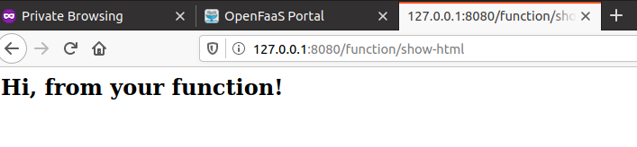

# Lab 6 - HTML for your functions

Trước khi thực hiện, chúng ta tạo thư mục mới
```
mkdir -p lab6OF && cd lab6OF
```

## Generate và return HTML từ function

Tạo hàm
```
faas-cli new --lang python3 show-html --prefix="<your-docker-username-here>"
```

Sửa `handler.py`
```
def handle(req):
    """handle a request to the function
    Args:
        req (str): request body
    """

    html = '<html><h2>Hi, from your function!</h2></html>'

    return html
```

Hàm này sẽ trả về một dạng Content-Type là text/html. Nhưng trước hết phải thêm `environment`

Chỉnh sửa show-html.yml
```
provider:
  name: openfaas
  gateway: http://127.0.0.1:8080

functions:
  show-html:
    lang: python3
    handler: ./show-html
    image: <your-docker-username-here>/show-html
    environment:
      content_type: text/html
```

Giờ build, push và deploy hàm
```
faas-cli up -f show-html.yml
```

Để xem mô tả bên trong hàm
```
faas-cli describe -f show-html.yml show-html
```


## Read và return một file static HTML

Trước hết tạo một thư mục tên là `html`. Sau đó, tạo một file tên `new.html`. Cấu trúc thư mục như sau
```
├── show-html
│   ├── __init__.py
│   ├── handler.py
│   ├── html
│   │   └── new.html
│   └── requirements.txt
└── show-html.yml
```

Sửa `new.html` file
```
<!DOCTYPE html>
<html lang='en'>
<head>
  <meta charset='UTF-8'>
  <title>OpenFaaS</title>
</head>
<body>
  <h2>Here's a new page!</h2>
</body>
</html>
```

Giờ, sửa `handler.py`
```
import os

def handle(req):
    """handle a request to the function
    Args:
        req (str): request body
    """

    dirname = os.path.dirname(__file__)
    path = os.path.join(dirname, 'html', 'new.html')

    with(open(path, 'r')) as file:
        html = file.read()

    return html
```

Giờ build, push và deploy
```
faas-cli up -f show-html.yml
```

Vào trình duyệt, gõ http://127.0.0.1:8080/function/show-html



Chúng ta sẽ tạo một URL mới, tên `list.html`

Tạo `list.html` trong thư mục `html`
```
<!DOCTYPE html>
<html lang='en'>
<head>
  <meta charset='UTF-8'>
  <title>OpenFaaS</title>
</head>
<body>
  <h2>This is a list!</h2>
  <ul>
    <li>One</li>
    <li>Two</li>
    <li>Three</li>
  </ul>
</body>
</html>
```

Sửa `handler.py`
```
import os

def handle(req):
    
    path = os.environ['Http_Path']
    pathArr = path.split("/")
    pageName = pathArr[1]
    
    dirname = os.path.dirname(__file__)
    page = os.path.join(dirname, 'html', pageName + '.html')

    with(open(page, 'r')) as file:
        html = file.read()

    return html
```

Up lại function
```
faas-cli up -f show-html.yml
```

Giờ truy cập html/new: http://127.0.0.1:8080/function/show-html/new


Còn html/list: http://127.0.0.1:8080/function/show-html/list


## Đọc query string và return HTML

Chuỗi truy vấn như là `Http_Query`. Có dạng như sau: http://127.0.0.1:8080/function/show-html?action=new

Sửa `handler.py`
```
import os
from urllib.parse import parse_qs

def handle(req):
    """handle a request to the function
    Args:
        req (str): request body
    """

    query = os.environ['Http_Query']
    params = parse_qs(query)
    action = params['action'][0]

    dirname = os.path.dirname(__file__)
    path = os.path.join(dirname, 'html', action + '.html')

    with(open(path, 'r')) as file:
        html = file.read()

    return html
```

Up function
```
faas-cli up -f show-html.yml
```

Giờ truy cập http://127.0.0.1:8080/function/show-html?action=new

Bạn sẽ thấy "Here's a new page!". Tức là giống như trước đó.

Còn http://127.0.0.1:8080/function/show-html?action=list

Sẽ hiển thị ra list. Vậy là ta đã thành công!

## Kết hợp với function khác

Ví dụ như hàm figlet.

Trước tiên, tạo một `figlet.html` file trong thư mục `html`.

```
<!DOCTYPE html>
<html lang='en'>
<head>
  <meta charset='UTF-8'>
  <title>OpenFaaS</title>
  <script
  src="https://code.jquery.com/jquery-3.3.1.min.js"
  integrity="sha256-FgpCb/KJQlLNfOu91ta32o/NMZxltwRo8QtmkMRdAu8="
  crossorigin="anonymous"></script>
  <style>
    .result {
        font-family: 'Roboto Mono', monospace;
    }
    </style>
</head>
<body>
  <h2>Figlet</h2>
  <p>
    Text: <input type="text" name="text" id="text"> 
    <button id="generate">Generate</button>
  </p>
  
  <textarea class="result" cols="80" rows="10"></textarea>

  <script type="text/javascript">
    $(function(){
      // Generate button click
      $('#generate').on('click', function() {
        // Execute ajax request
        $.ajax({
          url:'./figlet',
          type:'POST',
          data:$('#text').val()
        })
        .done(function(data) {
          // ajax success
          $('.result').val(data);
          console.log(data);
        })
        .fail(function(data) {
          // ajax failure
          $('.result').val(data);
          console.log(data);
        });
      });
    });
  </script>
</body>
</html>
```

Hàm này được viết JavaScript và Ajax bằng HTML

Còn `handler.py` không cần sửa. Giờ up function

```
faas-cli up -f show-html.yml
```

Truy cập http://127.0.0.1:8080/function/show-html?action=figlet

Với ứng dụng nào, chúng ta sẽ tạo ra những chức năng đơn giản bằng OpenFaaS.

Hết. Qua [lab7](lab7.md)